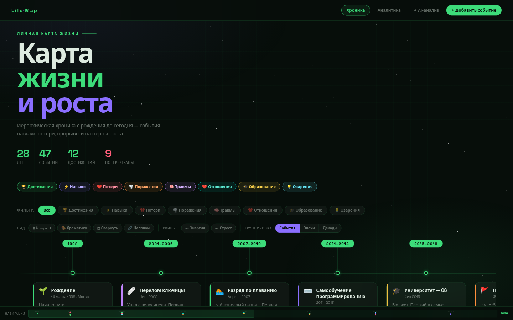
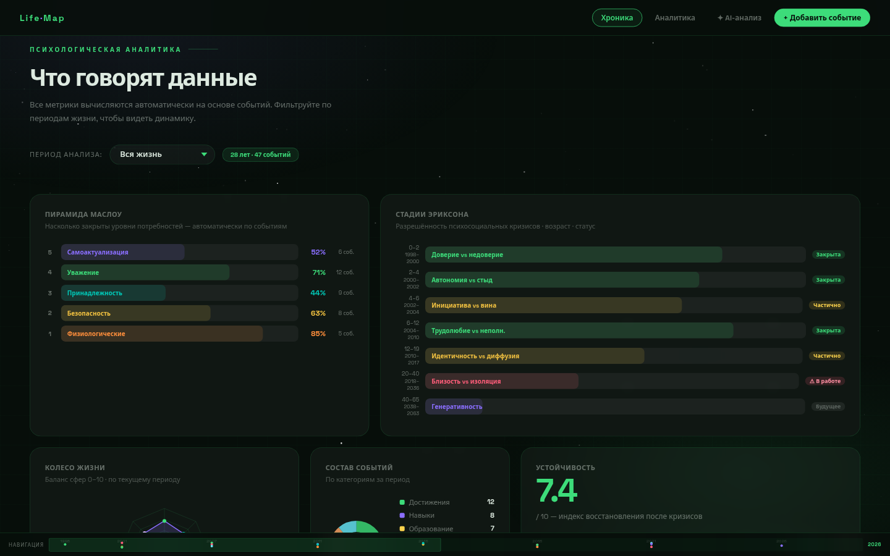

# Life Roadmap

Личное веб-приложение для глубокой саморефлексии и психологического самоанализа. Визуальная карта жизненного пути с научно обоснованными метриками психологического здоровья.



## Идея

Большинство инструментов трекинга жизни работают на уровне привычек или задач. Этот проект идёт глубже — он структурирует **события жизни** как данные и анализирует их через призму доказательной психологии: от пирамиды Маслоу до теории ментализации Фонаги.

Цель: видеть не просто хронологию, а **паттерны** — какие события запускают цепочки других, как менялась психологическая устойчивость, где дефициты и где ресурсы.

Проект полностью **local-first** — данные остаются у пользователя.

---

## Экраны

**Таймлайн жизни** с 8 интерактивными режимами просмотра:


**Психологическая аналитика** — 18 метрик с фильтром периода:



---

## Функциональность

### Таймлайн
Горизонтальная хроника событий с карточками. Восемь режимов отображения, переключаются на панели инструментов:

| Режим | Описание |
|-------|----------|
| **Impact Mapping** | Карточки смещаются выше/ниже оси по знаку события |
| **Temporal Chromatics** | Насыщенность цвета по эпохам — прошлое приглушено, настоящее ярко |
| **Compact Mode** | Свёрнутый вид — только заголовок и иконка |
| **Causal Lineage** | SVG-линии между причинно-следственно связанными событиями |
| **Trend Overlay** | Кривые энергии и стресса поверх таймлайна |
| **Semantic Zoom** | Три уровня детализации: события / эпохи / декады |
| **Progressive Disclosure** | Боковая панель с полным психологическим профилем события |
| **Navigation Minimap** | Фиксированная миникарта с синхронизацией прокрутки |

### 18 психологических метрик

| # | Метрика | Автор |
|---|---------|-------|
| 1 | Пирамида потребностей | А. Маслоу |
| 2 | Стадии развития | Э. Эриксон |
| 3 | Колесо жизни (radar) | — |
| 4 | Состав событий (donut) | — |
| 5 | Индекс устойчивости + главный паттерн | — |
| 6 | Эмоциональная дуга жизни | — |
| 7 | Зоны роста | — |
| 8 | Плотность событий по годам | — |
| 9 | Баланс полярностей | — |
| 10 | Ключевые инсайты | — |
| 11 | Иерархия защитных механизмов | Дж. Вайлант |
| 12 | Локус контроля | Дж. Роттер |
| 13 | Рефлексивное функционирование | П. Фонаги |
| 14 | Эго-состояния | Э. Берн / ТА |
| 15 | Окно толерантности | Д. Сигел |
| 16 | Экзистенциальный анализ | В. Франкл / А. Лэнгле |
| 17 | Теория самодетерминации | Э. Деси / Р. Райан |
| 18 | Когнитивные искажения | А. Бек / КБТ |

Все метрики реагируют на **фильтр периода** — от 1 месяца до всей жизни.

---

## Стек

### Текущий (Фаза 1 — готово)
| Слой | Технология |
|------|-----------|
| Фронтенд | Vanilla JS ES-модули |
| Стили | CSS Custom Properties, 12-col Grid |
| Сборка | Vite 8 |
| Графика | SVG без сторонних библиотек |
| Архитектура | `src/data/` · `src/metrics/` · `src/features/` · `src/styles/` |

### Планируемый (Фазы 2–4)
| Слой | Технология |
|------|-----------|
| API | FastAPI + Pydantic v2 |
| ORM | SQLAlchemy 2.0 async + Alembic |
| БД | PostgreSQL 16 + pgvector |
| Воркеры | ARQ (asyncio, без Celery) |
| Контейнеры | Docker Compose |
| Веб-сервер | nginx |
| Десктоп | Tauri (опционально) |

---

## Структура проекта

```
life-roadmap/
├── index.html              # HTML-шаблон (нет CSS и JS внутри)
├── src/
│   ├── main.js             # точка входа — импорт всего
│   ├── styles/             # 9 CSS-модулей
│   │   ├── base.css        # переменные, сброс, фон
│   │   ├── nav.css
│   │   ├── hero.css
│   │   ├── timeline.css    # таймлайн + все 8 режимов
│   │   ├── metrics.css     # 18 виджетов аналитики
│   │   ├── modal.css
│   │   ├── drawer.css
│   │   ├── minimap.css
│   │   └── footer.css
│   ├── data/               # статика (будет заменена API)
│   │   ├── events.js       # данные событий для Drawer
│   │   ├── periods.js      # датасеты по периодам
│   │   └── causal-links.js # причинно-следственные связи
│   ├── metrics/            # 16 психологических метрик
│   │   └── maslow.js · erikson.js · radar.js · ... (16 файлов)
│   └── features/           # 12 интерактивных фич
│       └── drawer.js · minimap.js · causal.js · ... (12 файлов)
├── docs/
│   ├── screenshot-timeline.png
│   └── screenshot-analytics.png
├── vite.config.js
├── package.json
└── ROADMAP.md              # детальный план с чекбоксами
```

---

## Запуск

```bash
npm install
npm run dev       # http://localhost:5173
npm run build     # production в /dist
```

---

## Что предстоит

Подробный план с чекбоксами — [`ROADMAP.md`](./ROADMAP.md).

### Фаза 2 — Бэкенд (PostgreSQL + FastAPI)
- **PostgreSQL 16 + pgvector** — семантический поиск по дневниковым записям, скрытые связи между событиями разных лет
- **Схема "Событие → Реакция"** — `parent_id → child_id`, Recursive CTE для сборки цепочек любой вложенности
- **JSONB для метрик** — Вайлант, Роттер и другие шкалы без жёстких миграций при добавлении новых
- **Alembic-миграции** — версионированная схема
- **Materialized Views** — Маслоу / Колесо жизни обновляются по триггеру, не при каждом запросе
- **Audit Log** через Postgres-триггеры — история изменений, undo/redo без логики в API
- **Ежемесячные снапшоты** психологического состояния через ARQ-воркер
- **Автобэкап**: `pg_dump` → зашифрованный локальный архив (без MinIO — избыточно для local-first)

### Фаза 3 — Интеграция фронт + бэкенд
- Заменить `src/data/*.js` на `fetch('/api/v1/...')`
- Создание и редактирование событий через Drawer → POST/PUT
- Семантический поиск через pgvector cosine similarity
- Undo через `audit_log` — восстановление любого предыдущего состояния
- Service Worker для офлайн-режима (кеш последнего состояния)

### Фаза 4 — Упаковка как приложение
- **Docker Compose** — один `docker compose up` запускает весь стек (postgres, api, nginx + фронт)
- `.desktop` файл — запуск из меню приложений Linux
- **Tauri** — тонкая Rust-оболочка вокруг localhost, даёт `.AppImage` без браузера (опционально)

---

*Проект в активной разработке · Апрель 2026*
